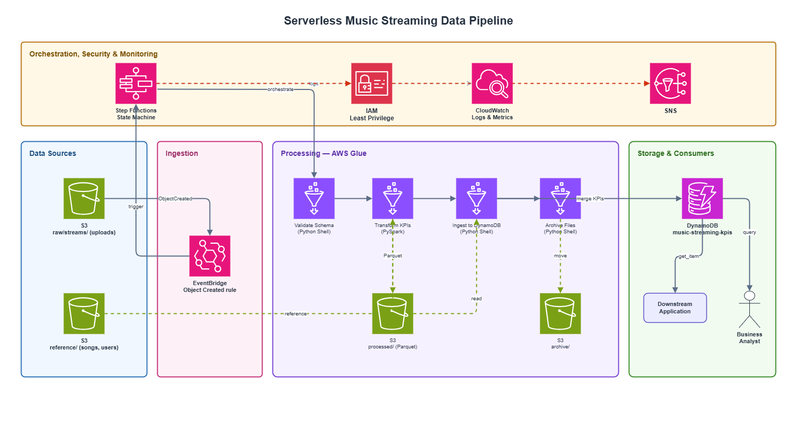

# Music Streaming Pipeline

A serverless AWS data pipeline that ingests batch CSV uploads of user
streaming events, validates and transforms them into daily KPIs with
PySpark, and serves the results from a single DynamoDB table for
millisecond-latency reads.

The pipeline is fully event-driven: drop a CSV into the `raw/streams/`
prefix and EventBridge wakes Step Functions, which orchestrates four AWS
Glue jobs end-to-end (validate → transform → ingest → archive) and emails
on any failure.

---

## Table of Contents

- [Overview](#overview)
- [Architecture](#architecture)
- [Prerequisites](#prerequisites)
- [Project Structure](#project-structure)
- [Quick Start](#quick-start)
- [Infrastructure Setup](#infrastructure-setup)
- [Pipeline Components](#pipeline-components)
- [KPIs Computed](#kpis-computed)
- [DynamoDB Table Design & Sample Queries](#dynamodb-table-design--sample-queries)
- [Testing](#testing)
- [CI/CD](#cicd)
- [Troubleshooting & Logging](#troubleshooting--logging)
- [Contributing](#contributing)

---

## Overview

Three input datasets land in S3:

| Dataset       | Rows   | Schema (key columns)                                                                                                                       |
|---------------|--------|--------------------------------------------------------------------------------------------------------------------------------------------|
| `streams*.csv`| ~11K   | `user_id`, `track_id`, `listen_time` (playback start timestamp — **not a duration**)                                                       |
| `songs.csv`   | ~89K   | `track_id`, `track_name`, `artists`, `track_genre`, `duration_ms`                                                                          |
| `users.csv`   | ~50K   | `user_id` (the only column the pipeline actually consumes)                                                                                 |

`songs.csv` and `users.csv` are static reference data and are uploaded to
S3 by Terraform during `apply`. `streams*.csv` files arrive over time and
each one independently triggers a new Step Functions execution.

Actual listening duration is derived by joining streams against
`songs.duration_ms` — `listen_time` is the playback **start** timestamp
and is never summed.

## Architecture



The data path:

```
S3 raw/streams/         EventBridge          Step Functions
   *.csv upload   ───►   "Object Created"  ─►  Standard Workflow
                                                     │
              ┌──────────────┬──────────────┬────────┴────────┬──────────────┐
              ▼              ▼              ▼                 ▼              ▼
        validate_schema  transform_kpis  ingest_to_dynamodb  archive_files  NotifyFailure
        (Python Shell)   (PySpark 4.0)    (Python Shell)     (Python Shell) (SNS email)
              │              │              │                 │              │
              ▼              ▼              ▼                 ▼              ▼
        exits 0/1     processed/*.parquet  KPI items      archive/         SNS topic
                                          in DynamoDB     raw -> archive
```

Every step has Retry (2 attempts, 30 s, 2.0 back-off, FULL jitter) and a
Catch block that fans out to `NotifyFailure`, which publishes a structured
error message to SNS before the state machine transitions to a `Fail`
state.

## Prerequisites

| Tool         | Version       | Notes                                                              |
|--------------|---------------|--------------------------------------------------------------------|
| Python       | 3.12.x        | Pinned via `.python-version`; `uv python install 3.12` if missing  |
| uv           | 0.11.x or newer | Package + Python manager (https://docs.astral.sh/uv)               |
| Terraform    | 1.7+          | Tested with 1.15                                                   |
| AWS CLI      | 2.x           | For `aws s3 cp`, `aws stepfunctions ...`                           |
| Java         | 11 or 17 (Linux) | PySpark requires a real Linux JDK — `sudo apt install openjdk-17-jdk-headless` on WSL |
| git          | any modern    | —                                                                  |

You also need:

- An AWS account with IAM permissions to create S3, DynamoDB, IAM, Glue,
  Step Functions, EventBridge, SNS, and CloudWatch Logs resources.
- A pre-existing S3 bucket for the Terraform remote state. The bucket
  name is passed via `-backend-config` on first `terraform init`.

## Project Structure

```
music-streaming-pipeline/
├── data/                                 # Canonical sample CSVs — DO NOT MODIFY
│   ├── songs/songs.csv
│   ├── streams/streams{1,2,3}.csv
│   └── users/users.csv
├── src/
│   ├── glue_jobs/                        # Uploaded to S3 by Terraform
│   │   ├── validate_schema.py            # Python Shell — schema + type check
│   │   ├── transform_kpis.py             # PySpark — KPI computation
│   │   ├── ingest_to_dynamodb.py         # Python Shell — Parquet -> DynamoDB
│   │   └── archive_files.py              # Python Shell — raw -> archive move
│   ├── step_functions/
│   │   └── state_machine.asl.json
│   └── utils/                            # Packaged as utils.zip, --extra-py-files
│       ├── logger.py
│       ├── schema_registry.py
│       ├── s3_helpers.py
│       └── dynamodb_helpers.py
├── tests/
│   ├── conftest.py                       # SparkSession + AWS-creds fixtures
│   ├── unit/                             # 55 tests, ~89% coverage
│   └── integration/                      # end-to-end with moto
├── terraform/
│   ├── modules/
│   │   ├── s3/                           # Bucket + EventBridge notif + lifecycle
│   │   ├── dynamodb/                     # PAY_PER_REQUEST, PITR, TTL
│   │   ├── iam/                          # 6 least-privilege roles
│   │   ├── glue/                         # 4 jobs + utils.zip + log groups
│   │   └── step_functions/               # State machine + EventBridge + SNS
│   └── environments/
│       ├── dev/                          # auto-deploy on push to development
│       └── prod/                         # manual-approval on push to main
├── .github/workflows/                    # CI + CD-dev + CD-prod
├── scripts/
│   ├── upload_sample_data.sh             # Drop a CSV in raw/streams/
│   └── query_dynamodb.sh                 # boto3 demos for the 3 KPI access patterns
├── docs/
│   └── architecture.drawio               # Placeholder — edit in diagrams.net
├── Makefile
├── pyproject.toml
└── README.md
```

## Quick Start

```bash
# 1. Install Python 3.12 and project dependencies
uv python install 3.12
make install                              # uv sync --all-extras

# 2. Install the Linux JDK needed by PySpark (one-time, WSL/Ubuntu)
sudo apt install -y openjdk-17-jdk-headless

# 3. Install git hooks so ruff + mypy run on every commit
make pre-commit-install

# 4. Run the local test suite
make test                                 # unit tests + coverage
```

## Infrastructure Setup

Each environment has its own backend state. Edit
`terraform/environments/<env>/terraform.tfvars` (gitignored — copy from a
template) before applying.

```bash
# Dev — auto-deployed by GitHub Actions on push to development
cd terraform/environments/dev
terraform init \
    -backend-config="bucket=<your-tfstate-bucket>" \
    -backend-config="region=<your-region>"
terraform apply -var-file=terraform.tfvars

# Prod — same flow with the prod env directory
cd terraform/environments/prod
terraform init -backend-config=...
terraform plan -var-file=terraform.tfvars   # gated by manual approval in CI
```

After `apply` succeeds:

1. Confirm the SNS email subscription (Terraform creates it in
   `PendingConfirmation`; click the link in the email).
2. Drop a stream batch: `./scripts/upload_sample_data.sh streams1.csv dev`.
3. Watch the Step Functions execution in the AWS console or via
   `aws stepfunctions list-executions --state-machine-arn $(terraform output -raw state_machine_arn)`.

## Pipeline Components

| Step                | Type                | Role ARN var               | What it does                                                                                                |
|---------------------|---------------------|----------------------------|-------------------------------------------------------------------------------------------------------------|
| `validate_schema`   | Glue Python Shell   | `glue-validate-schema`     | Reads the streams CSV; rejects if required columns missing, file empty, or `listen_time` unparseable        |
| `transform_kpis`    | Glue PySpark (G.1X×2) | `glue-transform-kpis`    | Broadcast-joins streams + songs + users; writes three Parquet datasets to `processed/`                       |
| `ingest_to_dynamodb`| Glue Python Shell   | `glue-ingest-to-dynamodb`  | Reads Parquet, batch-writes single-table items (`overwrite_by_pkeys=["pk","sk"]`)                          |
| `archive_files`     | Glue Python Shell   | `glue-archive-files`       | Copies raw CSV to `archive/`, deletes the source (idempotent on re-run)                                      |

The PySpark transform uses broadcast joins for both reference tables
(small enough to fit in driver memory) and caches the enriched DataFrame
before feeding it to three aggregations + a window-ranked top-N.

## KPIs Computed

Per `(track_genre, listen_date)` the transform emits:

| KPI                              | Definition                                                   |
|----------------------------------|--------------------------------------------------------------|
| `listen_count`                   | `COUNT(*)` of stream events (summed across the day's files)  |
| `unique_listeners`               | distinct `user_id` — the **union** of all the day's files    |
| `total_listening_time_ms`        | `SUM(songs.duration_ms)` (summed across the day's files)     |
| `avg_listening_time_per_user_ms` | `total / unique`, rounded to **2 dp** (derived after merge)  |

Plus:

- **Top-3 songs per genre per day** — ranked by cumulative play count
  desc, ties broken by `track_id` ascending.
- **Top-5 genres per day** — ranked by cumulative listen count desc,
  ties broken by `genre` ascending.

### Daily aggregation across files (incremental merge)

Daily KPIs reflect **every file for a day**, even when multiple batches share a
date. The transform emits per-file *partials* — `genre_partials/` (with a
`collect_set` of `user_id`) and `song_partials/` — under an execution-scoped
prefix `s3://<bucket>/processed/<execution_id>/` (so concurrent same-day runs
never clobber each other). The ingest job records each execution's contribution
as overwrite-keyed partial items in DynamoDB, then **recomputes** the served
KPIs from *all* partials for the affected day:

- counters (`listen_count`, `total_listening_time_ms`, `play_count`) are **summed**;
- `unique_listeners` is the size of the **union** of the per-file user-id sets
  (distinct counts are not additive);
- `avg_listening_time_per_user_ms` is derived from the merged totals.

Because every write is overwrite-keyed by execution, re-running a stage produces
identical output (idempotent, per the constitution).

## DynamoDB Table Design & Sample Queries

A single PAY_PER_REQUEST table holds all three KPI types, differentiated
by composite key prefixes:

| Item type       | `pk`                                    | `sk`           | Attributes                                                                                  |
|-----------------|-----------------------------------------|----------------|---------------------------------------------------------------------------------------------|
| Genre KPI       | `GENRE_KPI#<genre>#<YYYY-MM-DD>`        | `METADATA`     | `listen_count`, `unique_listeners`, `total_listening_time_ms`, `avg_listening_time_per_user_ms` |
| Top Songs slot  | `TOP_SONGS#<genre>#<YYYY-MM-DD>`        | `RANK#nn`      | `rank`, `track_id`, `track_name`, `artists`, `play_count`                                   |
| Top Genres slot | `TOP_GENRES#<YYYY-MM-DD>`               | `RANK#nn`      | `rank`, `genre`, `listen_count`                                                             |

`sk` rank slots are zero-padded to two digits (`RANK#01`, `RANK#02`, …)
for natural string ordering.

The same table also holds **internal** items used to make the daily merge
idempotent and correct (not queried by downstream apps):

| Internal item    | `pk`                              | `sk`                          | Purpose                                            |
|------------------|-----------------------------------|-------------------------------|----------------------------------------------------|
| Genre partial    | `GENRE_PARTIAL#<genre>#<date>`    | `EXEC#<execution_id>`         | One execution's listen_count / total / user-id set |
| Song partial     | `SONG_PARTIAL#<genre>#<date>`     | `EXEC#<execution_id>#TRACK#…` | One execution's per-track play_count               |
| Genre accumulator| `GENRECOUNT#<date>`               | `GENRE#<genre>`               | Cumulative listen_count, queried to rank Top-5     |

The served items (Genre KPI, Top Songs, Top Genres) are recomputed from these
on every merge, so the downstream query patterns below are unchanged.

### Sample queries — AWS CLI

```bash
# Genre KPI for pop on 2024-01-15
aws dynamodb get-item \
    --table-name dev-music-streaming-kpis \
    --key '{"pk":{"S":"GENRE_KPI#pop#2024-01-15"},"sk":{"S":"METADATA"}}'

# Top songs in pop on 2024-01-15
aws dynamodb query \
    --table-name dev-music-streaming-kpis \
    --key-condition-expression "pk = :pk AND begins_with(sk, :sk)" \
    --expression-attribute-values '{":pk":{"S":"TOP_SONGS#pop#2024-01-15"},":sk":{"S":"RANK#"}}'

# Top genres on 2024-01-15
aws dynamodb query \
    --table-name dev-music-streaming-kpis \
    --key-condition-expression "pk = :pk AND begins_with(sk, :sk)" \
    --expression-attribute-values '{":pk":{"S":"TOP_GENRES#2024-01-15"},":sk":{"S":"RANK#"}}'
```

### Sample queries — boto3 Python

```python
import boto3
from boto3.dynamodb.conditions import Key

table = boto3.resource("dynamodb", region_name="eu-central-1").Table(
    "dev-music-streaming-kpis"
)

# 1. Genre KPI for one (genre, date)
resp = table.get_item(Key={"pk": "GENRE_KPI#pop#2024-01-15", "sk": "METADATA"})
print(resp["Item"])
# -> {'pk': '...', 'sk': 'METADATA', 'listen_count': 4521, ...}

# 2. Top songs for (genre, date)
resp = table.query(
    KeyConditionExpression=(
        Key("pk").eq("TOP_SONGS#pop#2024-01-15") & Key("sk").begins_with("RANK#")
    )
)
for row in sorted(resp["Items"], key=lambda r: int(r["rank"])):
    print(row["rank"], row["track_name"], row["play_count"])

# 3. Top genres for one date
resp = table.query(
    KeyConditionExpression=(
        Key("pk").eq("TOP_GENRES#2024-01-15") & Key("sk").begins_with("RANK#")
    )
)
for row in sorted(resp["Items"], key=lambda r: int(r["rank"])):
    print(row["rank"], row["genre"], row["listen_count"])
```

Run the bundled helper for a live demo against your deployed table:

```bash
TABLE_NAME=dev-music-streaming-kpis ./scripts/query_dynamodb.sh 2024-01-15
GENRE=rock TABLE_NAME=dev-music-streaming-kpis ./scripts/query_dynamodb.sh 2024-01-15
```

## Testing

```bash
make lint        # ruff check
make typecheck   # mypy strict
make test        # pytest unit tests + coverage (gate: 80 %)
make test-all    # adds tests/integration (slower, mocked)
```

Current state: **55 unit tests, 89 % line coverage**.

Tests never touch real AWS:

- `moto[all]` mocks S3, DynamoDB, and IAM.
- A session-scoped `SparkSession` fixture (configured for `local[*]`,
  UTC, no shuffle parallelism) is shared across PySpark tests.
- AWS credential env vars are scrubbed in / out by the `aws_credentials`
  fixture so botocore can't accidentally reach the real cloud.

## CI/CD

Three GitHub Actions workflows under `.github/workflows/`:

| Workflow         | Trigger                | Jobs                                                                                |
|------------------|------------------------|-------------------------------------------------------------------------------------|
| `ci.yml`         | PR to development/main | `ruff check`, `mypy`, `pytest --cov=src --cov-fail-under=80`, `terraform validate`  |
| `cd-dev.yml`     | push to development    | tests gate → OIDC → `terraform apply` (auto)                                        |
| `cd-prod.yml`    | push to main           | tests gate → `terraform plan` → manual approval → `terraform apply`                 |

GitHub Actions authenticates to AWS via OIDC + an account-scoped role —
no static credentials in repo secrets.

## Troubleshooting & Logging

Every Glue job emits structured JSON to stdout (captured by CloudWatch).
Each record contains:

```json
{
  "level": "info",
  "job_name": "transform_kpis",
  "execution_id": "<step-functions-execution-name>",
  "message": "Enriched dataframe materialised",
  "row_count": 11346
}
```

CloudWatch log groups follow a predictable layout:

| Component                | Log group                                   |
|--------------------------|---------------------------------------------|
| validate_schema job      | `/aws-glue/jobs/<env>-validate-schema`      |
| transform_kpis job       | `/aws-glue/jobs/<env>-transform-kpis`       |
| ingest_to_dynamodb job   | `/aws-glue/jobs/<env>-ingest-to-dynamodb`   |
| archive_files job        | `/aws-glue/jobs/<env>-archive-files`        |
| state machine executions | `/aws/vendedlogs/states/<env>-music-streaming-pipeline` |

Common issues:

- **Step Functions execution never starts**
  Confirm the S3 bucket has `aws_s3_bucket_notification { eventbridge = true }`
  applied. EventBridge does not see ObjectCreated events otherwise.
- **`StartJobRun.sync` hangs forever**
  The Step Functions role is missing one of `glue:StartJobRun`,
  `glue:GetJobRun`, `glue:GetJobRuns`, or `glue:BatchStopJobRun`. All
  four are required for `.sync`.
- **`Provided list of item keys contains duplicates` on ingest**
  The DynamoDB batch writer wasn't initialised with
  `overwrite_by_pkeys=["pk","sk"]`. The shared helper handles this — use
  `dynamodb_helpers.batch_write_items` instead of calling
  `Table.batch_writer()` directly.

## Contributing

1. Branch from `development` using `feature/<short-description>`.
2. Conventional commits (`feat(...)`, `fix(...)`, `chore(...)`, etc.).
3. Run `make lint && make typecheck && make test` locally before pushing.
4. Pre-commit hooks enforce ruff and mypy on every commit — install
   them once with `make pre-commit-install`.
5. PRs target `development`. `main` only receives merges from `development`
   for a production deploy.

The `data/` directory is the canonical local test dataset — do not modify,
overwrite, or regenerate it.
